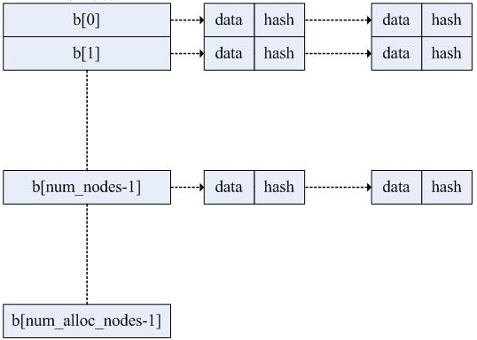

############
4 哈希表
############

::

    man lhash

***************
4.1 哈希表
***************

::

    在一般的数据结构如线性表和树中,录在结构中的相对位置是与记录的关键字之间不存在确定的关系，
    在结构中查找记录时需进行一系列的关键字比较. 
    这一类查找方法建立在"比较"的基础上, 查找的效率与比较次数密切相关。
    理想的情况是能直接找到需要的记录,因此必须在记录的存储位置和它的关键字之间建立确定的对应关系,
    使每个关键字和结构中一个唯一的存储位置相对应.
    在查找时,只需根据这个对应关系找到给定值.
    这种对应关系既是哈希函数，按这个思想建立的表为哈希表。

    哈希表存在冲突现象：
      不同的关键字可能得到同一哈希地址。
      在建造哈希表时不仅要设定一个好的哈希函数,而且要设定一种处理冲突的方法。

**********************
4.2 哈希表数据结构
**********************

openssl函数使用哈希表来加快查询操作，并能存放任意形式的数据，比如配置文件的读取、内存分配中被分配内存的信息等。其源码在crypto/lhash目录下。

openssl中的哈希表数据结构在lhash.h中定义如下：

::

    typedef struct lhash_node_st {
           void *data;
           struct lhash_node_st *next;
    #ifndef OPENSSL_NO_HASH_COMP
           unsigned long hash;
    #endif
    } LHASH_NODE;

    本结构是一个单链表。
    其中， data用于存放数据地址,
           next为下一个数据地址,
           hash为数据哈希计算值。

::    

    typedef struct lhash_st {
           LHASH_NODE **b;
           LHASH_COMP_FN_TYPE comp;
           LHASH_HASH_FN_TYPE hash;
           unsigned int num_nodes;
           unsigned int num_alloc_nodes;
           unsigned int p;
           unsigned int pmax;
           unsigned long up_load; /* load times 256 */
           unsigned long down_load; /* load times 256 */
           unsigned long num_items;
           unsigned long num_expands;
           unsigned long num_expand_reallocs;
           unsigned long num_contracts;
           unsigned long num_contract_reallocs;
           unsigned long num_hash_calls;
           unsigned long num_comp_calls;
           unsigned long num_insert;
           unsigned long num_replace;
           unsigned long num_delete;
           unsigned long num_no_delete;
           unsigned long num_retrieve;
           unsigned long num_retrieve_miss;
           unsigned long num_hash_comps;
           int error;
    } LHASH;

    其中，
        b指针数组用于存放所有的数据，数组中的每一个值为数据链表的头指针；
        comp用于存放数据比较函数地址；
        hash用于存放计算哈希值函数的地址；
        num_nodes为链表个数；
        num_alloc_nodes为b分配空间的大小。

基本的结构如下示图

***************
4.3 函数说明
***************

::

    1) LHASH *lh_TYPE_new(LHASH_HASH_FN_TYPE h, LHASH_COMP_FN_TYPE c)

       功能  : 生成哈希表
       源文件: lhash.c
       说明  : 输入参数 
                 h 为哈希函数，
                 c 为比较函数。 
               这两个函数都是回调函数。 
               因为哈希表用于存放任意的数据结构，
               哈希表存放、查询、删除等操作都需要比较数据和进行哈希运算，
               而哈希表不知道用户数据如何进行比较，也不知道用户数据结构中需要对哪些关键项进行散列运算.
               所以,用户必须提供这两个回调函数。

    2) void *lh_TYPE_delete(LHASH *lh, const void *data)

       源文件：lhash.c
       功能：删除散列表中的一个数据
       说明：data为数据结构指针。

    3) void lh_TYPE_doall(LHASH *lh, LHASH_DOALL_FN_TYPE func)

       源文件：lhash.c
       功能：处理哈希表中的所有数据
       说明：func为外部提供的回调函数，本函数遍历所有存储在哈希表中的数据，每个数据被func处理。

    4) void lh_TYPE_doall_arg(LHASH *lh, LHASH_DOALL_ARG_FN_TYPE func, void *arg)

       源文件：lhash.c
       功能：处理哈希表中所有数据
       说明：此参数类似于lh_doall 函数， func为外部提供的回调函数，
             arg为传递给func函数的参数。
             本函数遍历所有存储在哈希表中的数据，每个数据被func处理。

    5) void lh_TYPE_free(LHASH *lh)

       源文件：lhash.c
       功能：释放哈希表。

    6）void *lh_TYPE_insert(LHASH *lh, void *data)

       源文件：lhash.c
       功能：往哈希表中添加数据。
       说明：data为需要添加数据结构的指针地址。

    7）void *lh_retrieve(LHASH *lh, const void *data)

       源文件：lhash.c
       功能：查询数据。
       说明：从哈希表中查询数据，data为数据结构地址，
              此数据结构中必须提供关键项(这些关键项对应于用户提供的哈希函数和比较函数)以供查询，
              如果查询成功，返回数据结构的地址，否则返回NULL。
              比如SSL握手中服务端查询以前存储的SESSION时，
              它需要提供其中关键的几项：
                   SSL_SESSION *ret = NULL,data;
                   data.ssl_version = s->version;
                   data.session_id_length = len;
                   memcpy(data.session_id,session_id,len);
                   ret = (SSL_SESSION *)lh_retrieve(s->ctx->sessions,&data);

    8）void lh_node_stats_bio(const LHASH *lh, BIO *out)

       源文件：lh_stats.c
       功能：将哈希表中每个链表下的数据状态输出到BIO中。

    9）void lh_node_stats(const LHASH *lh, FILE *fp)

       源文件：lh_stats.c
       功能：将哈希表中每个链表下数据到个数输出到FILE中。
       说明：此函数调用了lh_node_stats_bio函数。

    10）void lh_node_usage_stats_bio(const LHASH *lh, BIO *out)

        源文件：lh_stats.c
        功能：将哈希表的使用状态输出到BIO中。

    11）void lh_node_usage_stats(const LHASH *lh, FILE *fp)

        源文件：lh_stats.c
        功能：将哈希表的使用状态输出到FILE中
        说明：此函数调用了lh_node_usage_stats_bio函数

    12）unsigned long lh_num_items(const LHASH *lh)

        源文件：lhash.   c
        功能：获取哈希表中元素的个数。

    13）void lh_stats_bio(const LHASH *lh, BIO *out)

        源文件：lh_stats.c
        功能：输出哈希表统计信息到BIO中
    14）void lh_stats(const LHASH *lh, FILE *fp)

        源文件：lh_stats.c
        功能：打印哈希表的统计信息，此函数调用了lh_stats_bio。

    15）unsigned long lh_strhash(const char *c)

        源文件：lhash.c
        功能：计算文本字符串到哈希值。

.. code:: cpp

    DEFINE_LHASH_OF(Student);
    IMPLEMENT_LHASH_DOALL_ARG(Student, int);

***************
4.4 编程示例
***************

.. literalinclude:: ./code/4/4/main.c
   :language: cpp

